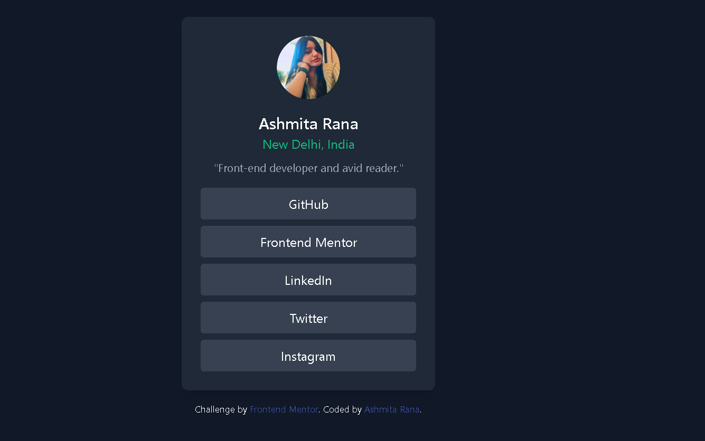

# Frontend Mentor - Social links profile solution

This is a solution to the [Social links profile challenge on Frontend Mentor](https://www.frontendmentor.io/challenges/social-links-profile-UG32l9m6dQ). Frontend Mentor challenges help you improve your coding skills by building realistic projects. 

## Table of contents

- [Overview](#overview)
  - [The challenge](#the-challenge)
  - [Screenshot](#screenshot)
  - [Links](#links)
- [My process](#my-process)
  - [Built with](#built-with)
  - [What I learned](#what-i-learned)
  - [Continued development](#continued-development)
  - [Useful resources](#useful-resources)
- [Author](#author)
- [Acknowledgments](#acknowledgments)cccccccccccc
**Note: Delete this note and update the table of contents based on what sections you keep.**

## Overview

### The challenge

Users should be able to:

- See hover and focus states for all interactive elements on the page

### Screenshot

 

## My process

### Built with

- Semantic HTML5 markup
- CSS custom properties
- Flexbox
- CSS Grid, Tailwind CSS

### What I learned

While working on this project, I learned how to effectively use Tailwind CSS to style components quickly and responsively. Tailwind's utility-first approach makes it easier to apply styles directly in the HTML, allowing for rapid development and iteration.

### Continued development

In future projects, I plan to delve deeper into Tailwind CSS to explore its more advanced features and utilities. I also aim to improve my proficiency in creating responsive layouts that adapt seamlessly to different screen sizes.

### Useful resources

Tailwind CSS Documentation - This is an amazing resource which helped me understand the utility-first approach of Tailwind CSS.
Frontend Mentor - A great platform for practicing front-end development skills with real-world projects.

## Author

- Website - [ASHMITA KUMARI](http://127.0.0.1:5500/social-links-profile-main/index.html)
- Frontend Mentor - [@ASHMITA](https://www.frontendmentor.io/profile/ashmitarana142)

## Acknowledgments

Challenge by Frontend Mentor. Coded by Ashmita Rana.